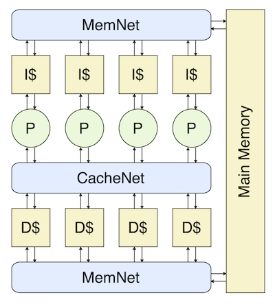
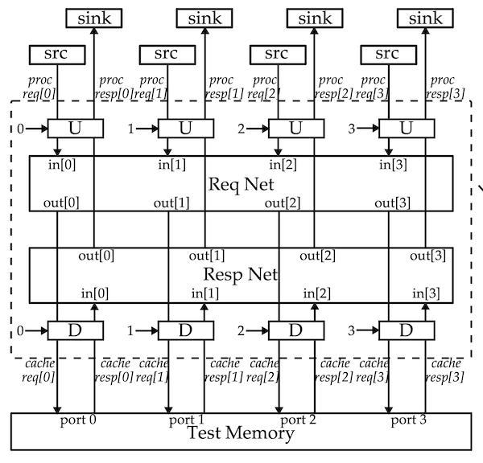
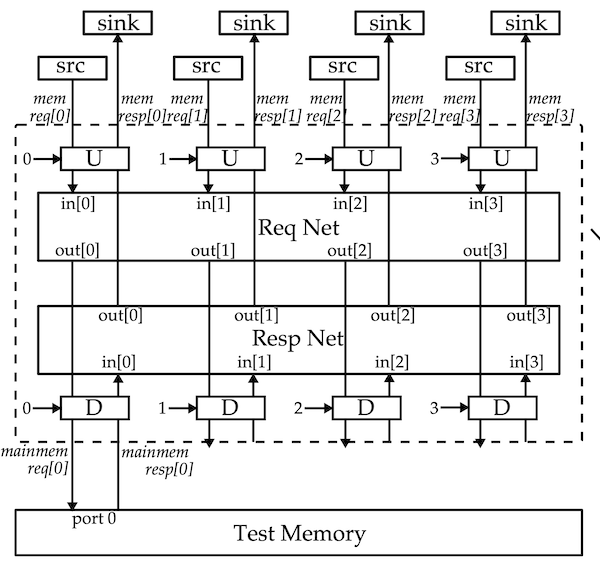
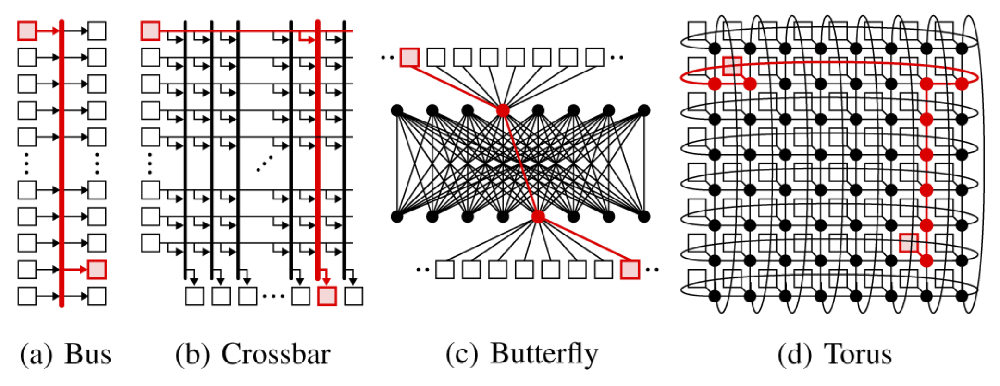
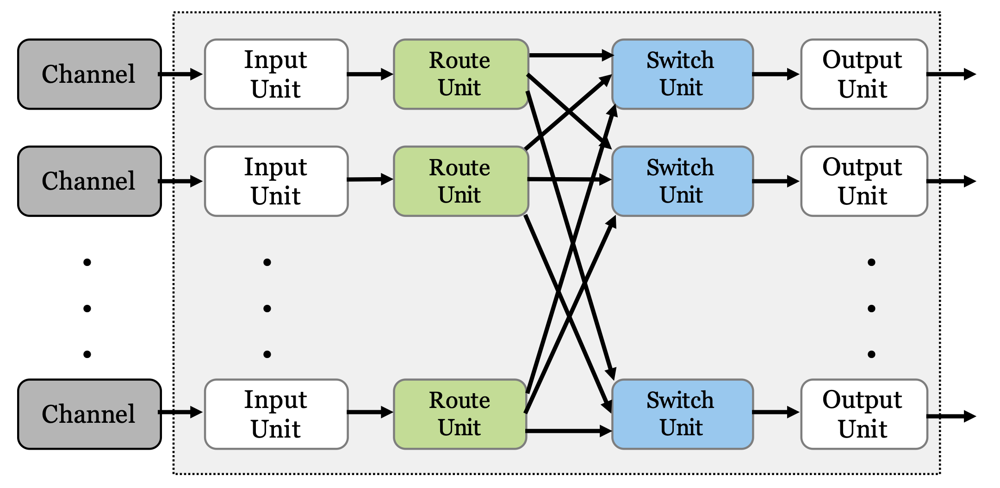

ECE 4750 Section 12: Networks
==========================================================================

 - Author: Christopher Batten
 - Date: November 18, 2022

**Table of Contents**

 - Network Overview
 - Implementing and Testing the Route Unit
 - Implementing and Testing the Switch Unit
 - Implementing and Testing the Router

This discussion section serves as a basic introduction to networks which
will help students implement a simple ring network for lab 4. You should
log into the `ecelinux` servers using the remote access option of your
choice and then source the setup script.

    % source setup-ece4750.sh
    % mkdir -p $HOME/ece4750
    % cd $HOME/ece4750
    % git clone git@github.com:cornell-ece4750/ece4750-sec12-net sec12
    % cd sec12
    % TOPDIR=$PWD
    % mkdir $TOPDIR/build

Network Overview
--------------------------------------------------------------------------

In order to implement the multicore processor shown below, we will need
to implement three networks: a cache network that interconnects each
processor's data memory interface to each of the four data cache banks, a
memory network that interconnects each data cache's memory interface to
main memory, and a memory network that interconnects each instruction
cache's memory interface to main memory.

The cache network actually includes _two_ networks: one that enables
processors to send cache requests to the caches and one that enables
caches to send cache reponses back to the processors. We alos need
adapters at the network interfaces to convert to/from memory messages and
network messages.

The memory networks also include _two_ networks. The primary differences
it at there is only a single destination.

More generally, a network enable sending messages from a set of input
terminals and a set of output terminals. Bus and crossbar networks use
long global wires that every input terminal can write and every output
terminal can read.

Bus topologies are simple but offer low throughput. Crossbar topologies
enable higher throughput, but are also more expensive in terms of area
and energy. Scalable networks use a set of smaller _routers_
interconnected by shorter _channels_ to create a network _topology_.
Examples include butterfly any torus topologies. In lab 4, you will be
implementing a simple 1D torus topology (i.e., a four node ring) which
only uses nearest neightbor communication.

In addition to the network topology, a network microarchitecture will
also need to implement a network routing algorithm (what path should we
take to get from a give input terminal to a given output terminal?) and a
network flow control scheme (how should we allocate resources like ports
and buffers?).

We can use _zero load latency_ and _ideal terminal throughput_ to analyze
the first-order performance of a network. The zero load latency is the
number of cycles it takes for a packet to go from the input terminals to
the output terminals assuming a specific traffic pattern. The ideal
terminal throughput is the maximum achievable throughput an input
terminal can achieve assuming a specific traffic pattern, a perfect
routing algorithm, and a perfect flow control scheme. We will discuss the
zero load latency and ideal terminal throughput of our simple four node
ring network topology in the discussion section.

Each router in our network will have three input ports and three output
ports. All ports will use latency insensitive stream interfaces. We will
use the following router microarchitecture which includes three input
queues, three route units, and three switch units. The route units
determine which output port a given input message should be sent, while
the switch units arbitrate when multiple input ports want to send a
message to the same output port.

All of our networks will work with network packets that use the following
format.

     43  42 41  40 39    32 31            0
    +------+------+--------+---------------+
    | dest | src  | opaque |    payload    |
    +------+------+--------+---------------+

This network packet is shown with a payload of 32 bits, but our networks
will actually be parameterized by the payload size so we can use a single
network implementation in the cache request network, cache response
network, memory request network, and memory response network.

Implementing and Testing the Route Unit
--------------------------------------------------------------------------

We will start by implementing a very basic route unit. Take a look at the
route unit in `lab4_sys/NetRouterRouteUnit.v`. The interface looks like
this:

    module lab4_sys_NetRouterRouteUnit
    #(
      parameter p_msg_nbits = 44
    )
    (
      input  logic                   clk,
      input  logic                   reset,

      // Router id (which router is this in the network?)

      input  logic     [1:0]         router_id,

      // Input stream

      input  logic [p_msg_nbits-1:0] istream_msg,
      input  logic                   istream_val,
      output logic                   istream_rdy,

      // Output stream 0

      output logic [p_msg_nbits-1:0] ostream0_msg,
      output logic                   ostream0_val,
      input  logic                   ostream0_rdy,

      // Output stream 0

      output logic [p_msg_nbits-1:0] ostream1_msg,
      output logic                   ostream1_val,
      input  logic                   ostream1_rdy,

      // Output stream 0

      output logic [p_msg_nbits-1:0] ostream2_msg,
      output logic                   ostream2_val,
      input  logic                   ostream2_rdy
    );

The route unit has one input stream interface and three output stream
interfaces. The route unit we will implement in the discussion section
will simply use the destination field of the network message as the
output port. For the ring network you will need to implement a more
complicated route unit that picks an output port based on your desired
routing algorithm and the current routers id.

Go ahead and complete the implementation of the route unit. You want to
first check to make sure the input stream is valid, check the destination
field, and use the destination field to set the appropriate output stream
valid signal and input stream ready signal. Once you have finished you
can test your route unit like this:

    % cd $TOPDIR/build
    % pytest ../lab4_sys/test/NetRouterRouteUnit_test.py

Use the `-k` and `-s` command line options to view the line traces for
specific test cases.

Implementing and Testing the Switch Unit
--------------------------------------------------------------------------

Next we need to implement a very basic switch unit. Take a look at the
switch unit in `lab4_sys/NetRouterSwitchUnit.v`. The interface looks like
this:

    module lab4_sys_NetRouterSwitchUnit
    #(
      parameter p_msg_nbits = 44
    )
    (
      input  logic                   clk,
      input  logic                   reset,

      // Input stream 0

      input  logic [p_msg_nbits-1:0] istream0_msg,
      input  logic                   istream0_val,
      output logic                   istream0_rdy,

      // Input stream 1

      input  logic [p_msg_nbits-1:0] istream1_msg,
      input  logic                   istream1_val,
      output logic                   istream1_rdy,

      // Input stream 2

      input  logic [p_msg_nbits-1:0] istream2_msg,
      input  logic                   istream2_val,
      output logic                   istream2_rdy,

      // Output stream

      output logic [p_msg_nbits-1:0] ostream_msg,
      output logic                   ostream_val,
      input  logic                   ostream_rdy
    );

The switch unit has three input stream interfaces and one output stream
interface. The switch unit we will implement in the discussion section
will simply use a fixed priority. If multiple input ports want to use a
given output port, we give highest priority to the input port with the
lowest index (i.e., input port 0 has the highest priority). Technically
this will probably work in the ring network, but it could perform poorly
since it does not attempt to provide any kind of fair arbitration across
the input ports. Students may want to experiment with more sophisticated
arbitration schemes such as round-robin arbitration.

Go ahead and complete the implementation of the switch unit. You want to
check each of the input streams valid signals in priority order and as
soon as you find a valid input stream set the output stream valid bit,
output stream message, and input stream ready signal appropriately. Once
you have finished you can test your route unit like this:

    % cd $TOPDIR/build
    % pytest ../lab4_sys/test/NetRouterSwitchUnit_test.py

Use the `-k` and `-s` command line options to view the line traces for
specific test cases.

Implementing and Testing the Router
--------------------------------------------------------------------------

Now that we have implemented and tested the route unit and switch unit,
we can compose them with the input queues to implement the three-port
router. Take a look at the switch unit in `lab4_sys/NetRouter.v`. The
interface looks like this:

    module lab4_sys_NetRouter
    #(
      parameter p_msg_nbits = 44
    )
    (
      input  logic                   clk,
      input  logic                   reset,

      // Router id (which router is this in the network?)

      input  logic     [1:0]         router_id,

      // Input stream 0

      input  logic [p_msg_nbits-1:0] istream0_msg,
      input  logic                   istream0_val,
      output logic                   istream0_rdy,

      // Input stream 1

      input  logic [p_msg_nbits-1:0] istream1_msg,
      input  logic                   istream1_val,
      output logic                   istream1_rdy,

      // Input stream 2

      input  logic [p_msg_nbits-1:0] istream2_msg,
      input  logic                   istream2_val,
      output logic                   istream2_rdy,

      // Output stream 0

      output logic [p_msg_nbits-1:0] ostream0_msg,
      output logic                   ostream0_val,
      input  logic                   ostream0_rdy,

      // Output stream 0

      output logic [p_msg_nbits-1:0] ostream1_msg,
      output logic                   ostream1_val,
      input  logic                   ostream1_rdy,

      // Output stream 0

      output logic [p_msg_nbits-1:0] ostream2_msg,
      output logic                   ostream2_val,
      input  logic                   ostream2_rdy
    );

The router has three input streams and three output streams. We have
provided the composition for the router for you. You can test the router
like this:

    % cd $TOPDIR/build
    % pytest ../lab4_sys/test/NetRouter_test.py

Use the `-k` and `-s` command line options to view the line traces for
specific test cases. Here is what the line trace looks like.

         src0   src1   src2     qqq rrr sss  out0   out1   out2     sink0  sink1  sink2
     1r       |      |       > (   (   |   )      |.     |.     ) >       |.     |.
     2r       |      |       > (   (   |   )      |.     |.     ) >       |.     |.
     3:       |      |       > (   (   |   )      |.     |.     ) >       |.     |.
     4: 0>0:00|1>0:00|2>0:00 > (   (   |   )      |      |      ) >       |      |
     5: 0>0:01|1>0:01|2>0:01 > (...(0  |0  )0>0:00|      |      ) > 0>0:00|      |
     6: 0>0:02|1>0:02|2>0:02 > (...(0  |0  )0>0:01|      |      ) > 0>0:01|      |
     7: 0>0:03|1>0:03|2>0:03 > (...(0  |0  )0>0:02|      |      ) > 0>0:02|      |
     8: 0>0:04|#     |#      > (...(0  |0  )0>0:03|      |      ) > 0>0:03|      |
     9: 0>0:05|#     |#      > (...(0  |0  )0>0:04|      |      ) > 0>0:04|      |
    10: 0>0:06|#     |#      > (...(0  |0  )0>0:05|      |      ) > 0>0:05|      |
    11: 0>0:07|#     |#      > (...(0  |0  )0>0:06|      |      ) > 0>0:06|      |
    12: 0>0:08|#     |#      > (...(0  |0  )0>0:07|      |      ) > 0>0:07|      |
    13: 0>0:09|#     |#      > (...(0  |0  )0>0:08|      |      ) > 0>0:08|      |
    14: 0>0:0a|#     |#      > (...(0  |0  )0>0:09|      |      ) > 0>0:09|      |
    15: 0>0:0b|#     |#      > (...(0  |0  )0>0:0a|      |      ) > 0>0:0a|      |
    16: 0>0:0c|#     |#      > (...(0  |0  )0>0:0b|      |      ) > 0>0:0b|      |
    17: 0>0:0d|#     |#      > (...(0  |0  )0>0:0c|      |      ) > 0>0:0c|      |
    18: 0>0:0e|#     |#      > (...(0  |0  )0>0:0d|      |      ) > 0>0:0d|      |
    19: 0>0:0f|#     |#      > (...(0  |0  )0>0:0e|      |      ) > 0>0:0e|      |
    20:       |#     |#      > (...(0  |0  )0>0:0f|      |      ) > 0>0:0f|      |
    21:       |#     |#      > (   ( 0 |1  )1>0:00|      |      ) > 1>0:00|      |
    22:       |1>0:04|#      > (   ( 0 |1  )1>0:01|      |      ) > 1>0:01|      |
    23:       |1>0:05|#      > (   ( 0 |1  )1>0:02|      |      ) > 1>0:02|      |
    24:       |1>0:06|#      > (   ( 0 |1  )1>0:03|      |      ) > 1>0:03|      |
    25:       |1>0:07|#      > (   ( 0 |1  )1>0:04|      |      ) > 1>0:04|      |
    26:       |1>0:08|#      > (   ( 0 |1  )1>0:05|      |      ) > 1>0:05|      |
    27:       |1>0:09|#      > (   ( 0 |1  )1>0:06|      |      ) > 1>0:06|      |

You can see that src0 gets to send all of its messages first since it is
given highest priority, and then src1 is able to start sending its
messages.
